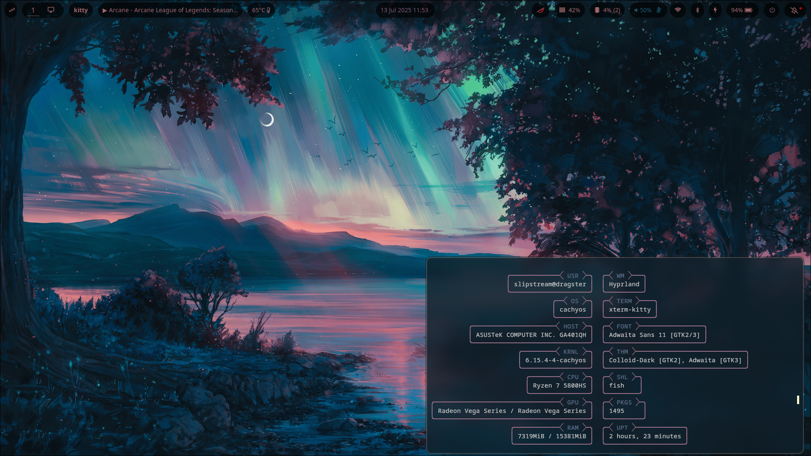
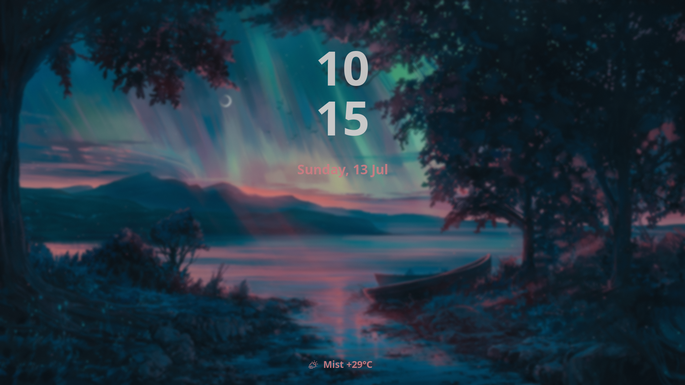

# Dotfiles
My own personal linux dotfiles

## My current setup

## My current lockscreen setup (Hyprlock)

## My current configuration
**Laptop** : [Asus Zephyrus G14 2021](https://rog.asus.com/laptops/rog-zephyrus/2021-rog-zephyrus-g14-series/)

**Current Distro** : [CachyOS](https://cachyos.org/)

**Shell used** : [fish](https://github.com/fish-shell/fish-shell)

**Window Manager used** : [Hyprland](https://hyprland.org/)

**Terminal emulator used** : [kitty](https://github.com/kovidgoyal/kitty)

**nvim config used** : [StratVIM](https://github.com/StratOS-Linux/StratVIM)

**tmux config used** : A slightly modified version of [oh-my-tmux](https://github.com/gpakosz/.tmux)
